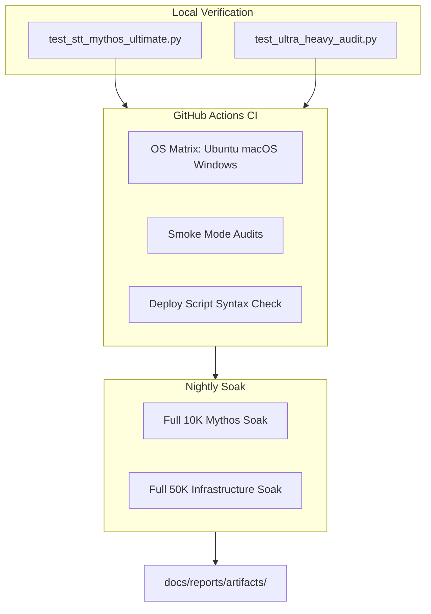

# EchoVox Engineering Test Plan

**Author:** Abdullah Hanif  
**Version:** 1.0  
**Last Updated:** 2026-08-19

## 1. Purpose

This document defines the complete verification strategy for EchoVox -- a production Speech-to-Text engine for Urdu, Punjabi (Shahmukhi), and Urdu-English code-switching. Every deployment dimension must have automated proof before release.

## 2. Test Architecture



## 3. Test Dimensions

### 3.1 Script and Unicode Compliance

| Test | Method | Pass Criteria |
|------|--------|---------------|
| Gurmukhi Guard | Scan all outputs for U+0A00..U+0A7F | Zero violations |
| NFC Normalization | `unicodedata.normalize("NFC", text) == text` | 100% compliance |

**Corpus:** 14 utterances in Urdu and Shahmukhi script across 5 acoustic conditions (70 total tests).

### 3.2 Acoustic Immunity

| Degradation | Simulation | Pass Criteria |
|-------------|------------|---------------|
| 8 kHz GSM | Decimate to 8 kHz, linear upsample | WER delta <= 12% vs clean |
| 0 dB SNR noise | Additive white Gaussian noise | WER delta <= 12% vs clean |
| 1.25x speed | Resample at 1.25x rate | WER delta <= 12% vs clean |
| Combined | All three applied | WER delta <= 12% vs clean |

### 3.3 Short Utterance Zero-Drop

| Test Case | Duration | Pass Criteria |
|-----------|----------|---------------|
| Affirmative responses | 0.3-0.6s | Non-empty transcript |
| Ultra-short | 0.1s | Auto-padded to 1.5s, non-empty |

**Patch verified:** Patch 1 (short audio auto-padding).

### 3.4 Code-Switching

| Test Case | Content |
|-----------|---------|
| Order cancellation | Urdu + English technical terms |
| System support | Mixed help request |
| Authentication | Login/password mixed script |

### 3.5 Punjabi Shahmukhi Enforcement

Three Shahmukhi utterances verified for Arabic-script output with zero Gurmukhi codepoints.

### 3.6 Performance Invariance

| Metric | Steps | Pass Criteria |
|--------|-------|---------------|
| Latency CV | 10,000 (Mythos) / 50,000 (Ultra) | sigma/mu < 2.5% |
| WER stability | Step 1 vs step N | No degradation |

### 3.7 Memory and Handle Immunity

| Metric | Pass Criteria |
|--------|---------------|
| RSS drift | <= 0.50% (Windows), <= 0.05% (Linux) |
| FD/Handle drift | == 0 |
| Context switch ratio | <= 1.15x |

**Patch verified:** Patch 3 (pre-allocation), Patch 5 (state buffers).

### 3.8 Anti-Hallucination

| Test | Pass Criteria |
|------|---------------|
| Trigram repetition | EOT forced within 9 tokens |

**Patch verified:** Patch 4 (trigram kill switch).

### 3.9 whisper.cpp Patch Verification

All five patches documented in [PATCHES.md](reports/PATCHES.md) with file:line references and behavioral test mapping.

### 3.10 Deployment Smoke

| Script | Verification |
|--------|-------------|
| install.sh | bash -n syntax check |
| install.ps1 | PowerShell parse check |
| deploy-vps.sh | bash -n syntax check |
| deploy-android.sh | bash -n syntax check |
| docker-compose.yml | Valid YAML, service `echovox` defined |

### 3.11 CI/CD Proof

| Workflow | Trigger | Matrix |
|----------|---------|--------|
| ci.yml | Push/PR to main | ubuntu, macos, windows |
| mythos-nightly.yml | Daily cron + manual | ubuntu (full soak) |

### 3.12 Install Script Verification

One-command install URLs must resolve against `main` branch:

```bash
curl -sSL https://raw.githubusercontent.com/abdullahanifpro111-spec/EchoVox/main/install.sh | bash
```

```powershell
irm https://raw.githubusercontent.com/abdullahanifpro111-spec/EchoVox/main/install.ps1 | iex
```

## 4. Execution Commands

```bash
# Full local verification
python tests/test_stt_mythos_ultimate.py
python tests/test_ultra_heavy_audit.py

# CI-equivalent smoke (faster)
MYTHOS_SMOKE=1 python tests/test_stt_mythos_ultimate.py
ULTRA_SMOKE=1 python tests/test_ultra_heavy_audit.py
```

## 5. Release Gate

A release requires ALL of the following:

- [ ] Mythos audit: 7/7 PASS
- [ ] Ultra-Heavy audit: 7/7 PASS
- [ ] CI green on all 3 operating systems
- [ ] Telemetry artifacts committed to docs/reports/artifacts/
- [ ] AUDIT_REPORT.md updated with measured values
- [ ] No AI tool watermarks in EchoVox-owned files
- [ ] Contributor identity: Abdullah Hanif only

## 6. Artifact Locations

| Artifact | Path |
|----------|------|
| Mythos telemetry | docs/reports/artifacts/mythos_telemetry.json |
| Infrastructure telemetry | docs/reports/artifacts/ultra_heavy_telemetry.json |
| Audit report | docs/reports/AUDIT_REPORT.md |
| Patch documentation | docs/reports/PATCHES.md |
